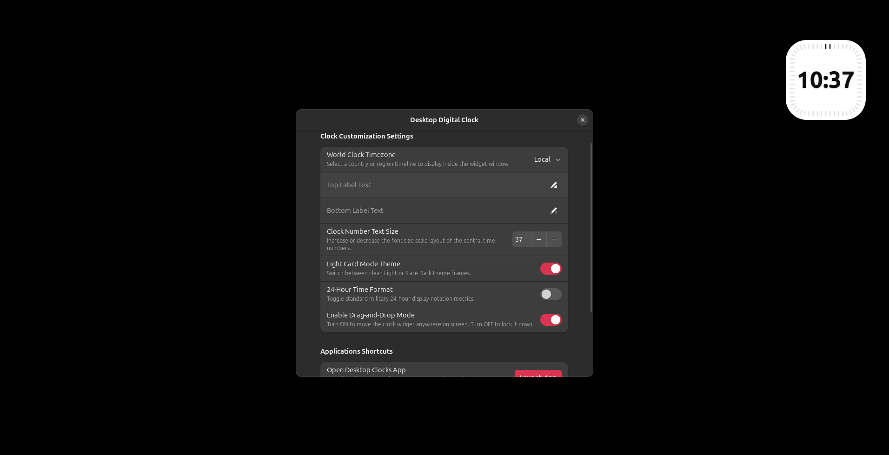
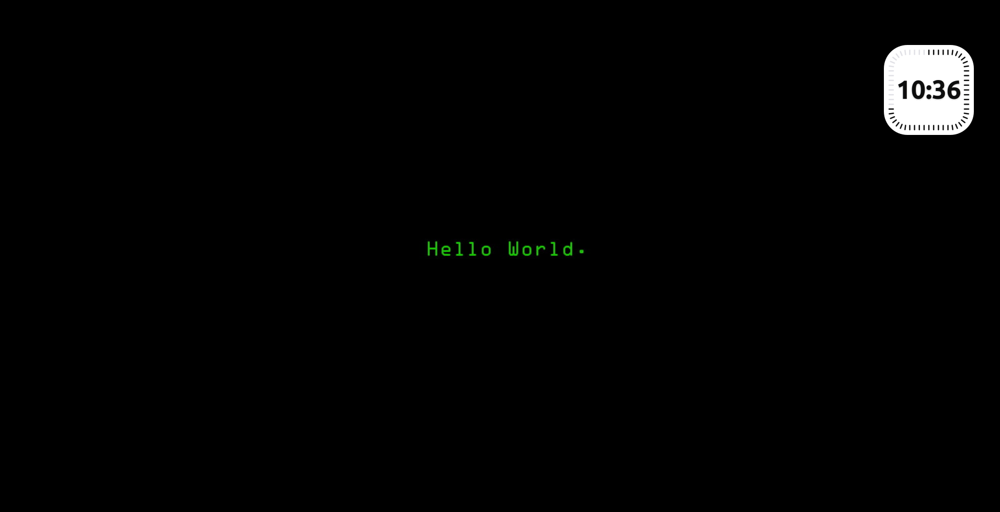
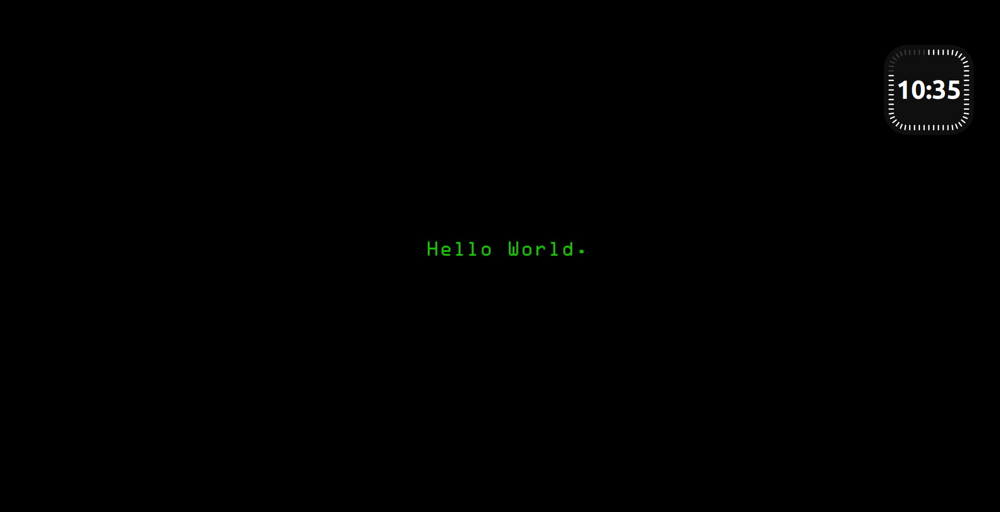

# 🕰️ Digital Desktop Clock (GNOME Extension)

An elegant, highly customizable floating digital desktop clock widget for GNOME Shell, meticulously designed with clean geometric squircle aesthetics and a premium desktop experience.


---

## ✨ Features

* **Floating Desktop Widget**
  Renders crisp Cairo graphics directly onto your desktop wallpaper layer, staying cleanly beneath open windows.

* **Drag-and-Drop Positioning**
  Freely reposition the clock using the built-in Drag Mode available in the preferences panel.

* **Dynamic Theme Support**
  Switch seamlessly between elegant Light Mode and deep Onyx Dark Mode themes.

* **World Clock Support**
  Display time from different regions with built-in timezone support.

* **Double-Click App Launcher**
  Double-click the clock widget to instantly open the native GNOME Clock application.

* **Minimal Resource Usage**
  Designed to be lightweight and efficient for everyday desktop usage.

---

## 📸 Screenshot

> Add a screenshot of your extension here.

## 📸 Screenshot

### Desktop Digital Clock Widget



### Light Theme



### Dark Theme




## 📸 Screenshot

<p align="center">
  
  
  
</p>

---

## 🖥️ Compatibility

Supported GNOME Shell versions:

* GNOME 45
* GNOME 46
* GNOME 47
* GNOME 48
* GNOME 49
* GNOME 50

> Verify supported versions in your `metadata.json` file.

---

## 🚀 Installation

### Option 1: GNOME Extensions Website (Recommended)

Once published, install directly from the official GNOME Extensions website:

https://extensions.gnome.org

---

### Option 2: Extension Manager

1. Install the Extension Manager application:

```bash
flatpak install flathub com.mattjakeman.ExtensionManager
```

2. Open **Extension Manager**.
3. Navigate to the **Browse** tab.
4. Search for **Digital Desktop Clock**.
5. Click **Install**.

---

### Option 3: Manual Installation

Clone and install the extension locally:

```bash
mkdir -p ~/.local/share/gnome-shell/extensions/digital-clock@sanjay.dev

git clone https://github.com/SANJAY-N0/digital-desktop-Clock.git temp-clock

cp -r temp-clock/* \
~/.local/share/gnome-shell/extensions/digital-clock@sanjay.dev/

rm -rf temp-clock
```

Alternatively:

```bash
git clone https://github.com/SANJAY-N0/digital-desktop-Clock.git

cd digital-desktop-Clock

mkdir -p ~/.local/share/gnome-shell/extensions/

cp -r digital-clock@sanjay.dev \
~/.local/share/gnome-shell/extensions/
```

---

## 🔄 Reload GNOME Shell

After installation, reload GNOME Shell:

### X11

Press:

```text
Alt + F2
```

Then type:

```text
r
```

and press **Enter**.

### Wayland

Log out and log back in.

---

## ✅ Enable the Extension

Using the command line:

```bash
gnome-extensions enable digital-clock@sanjay.dev
```

Or enable it using:

* Extension Manager
* GNOME Extensions application

---

## 🛠️ Development

Clone the repository:

```bash
git clone https://github.com/SANJAY-N0/digital-desktop-Clock.git

cd digital-desktop-Clock
```

Project structure:

```text
digital-desktop-Clock/
├── extension.js
├── prefs.js
├── stylesheet.css
├── metadata.json
└── README.md
```

---

## 🤝 Contributing

Contributions, bug reports, and feature requests are welcome.

1. Fork the repository.
2. Create a feature branch.
3. Commit your changes.
4. Submit a pull request.

---

## 📄 License

This project is licensed under the **GPL-3.0 License**.

See the `LICENSE` file for more information.

---

## ⭐ Support

If you found this project useful:

* ⭐ Star the repository
* 🐛 Report issues
* 💡 Suggest new features
* 🤝 Contribute improvements
